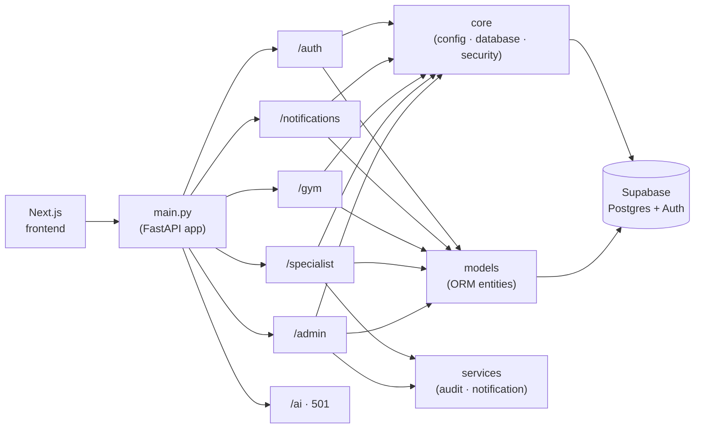
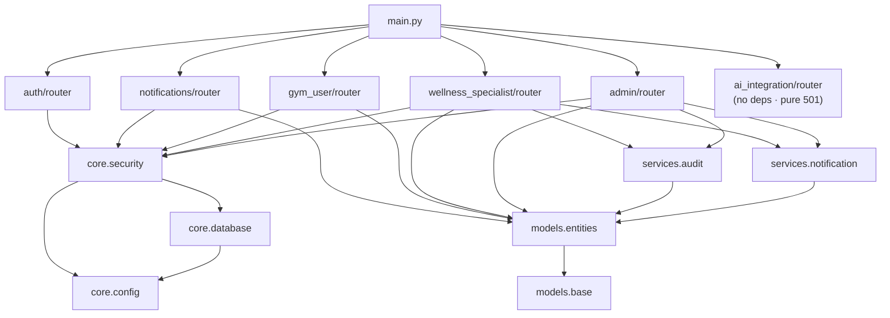

# OneFit Backend — Routes & Architecture

A presentation-friendly map of the FastAPI backend: how requests flow from the
frontend through `main.py` into each subsystem, what each subsystem is for, the
HTTP routes it exposes, and how the modules depend on one another.

> 4-tier architecture (SDD §5.1): the FastAPI app is the **application tier** that
> mediates all traffic between the Next.js frontend, Supabase (data + auth), and —
> in future — the AI providers.

## 1. Request flow (high level)

## 2. The subsystems — what each one is for

| Prefix | Subsystem | Purpose (SDD ref) |
|--------|-----------|-------------------|
| `/auth` | Authentication *(platform service)* | Register & login by proxying Supabase GoTrue so the frontend only talks to FastAPI. UC1 / UC2. |
| `/notifications` | Notifications *(platform service)* | Any authenticated user lists & acknowledges their own notifications. UC10. |
| `/gym` | Gym User | Manual (no-AI) workout builder, profile, activity/diet logging, progress & dashboard. UC3–UC6. |
| `/specialist` | Wellness Specialist | Progress review, educational content, professional feedback, and the meal-plan canvas. UC3 / UC4. |
| `/admin` | Admin | Manage users, approve registrations, suspend/reinstate, assign roles, announcements — all audited. UC1–UC8. |
| `/ai` | AI & Integration | **Deferred.** Seam for future AI (plan generation, nutrition lookup). Stubs return **501** so the frontend can wire to the contract now. |

## 3. Routes per subsystem

### `/auth` — Authentication
- `POST /auth/register`
- `POST /auth/login`
- `GET  /auth/me`

### `/notifications` — Notifications
- `GET   /notifications`
- `PATCH /notifications/{notification_id}/read`

### `/gym` — Gym User
- `GET /gym/profile` · `PUT /gym/profile`
- `GET /gym/plans` · `POST /gym/plans`
- `POST /gym/activity`
- `POST /gym/diet`
- `GET /gym/dashboard`
- `GET /gym/progress` · `POST /gym/progress`
- `GET /gym/meal-plans`
- `GET /gym/milestones`
- `GET /gym/sessions` · `POST /gym/sessions`

### `/specialist` — Wellness Specialist
- `GET /specialist/content` · `POST /specialist/content` · `PATCH /specialist/content/{content_id}`
- `POST /specialist/feedback`
- `POST /specialist/announcements`
- `GET /specialist/clients` · `GET /specialist/clients/{user_id}`
- `GET /specialist/clients/{user_id}/activity`
- `GET /specialist/clients/{user_id}/diet`
- `GET /specialist/clients/{user_id}/progress`
- `GET /specialist/meal-plans` · `POST /specialist/meal-plans`
- `GET /specialist/tasks` · `POST /specialist/tasks`
- `GET /specialist/community/groups`
- `GET /specialist/community/groups/{group_id}/posts`
- `POST /specialist/community/posts/{post_id}/moderate`
- `GET /specialist/health-trends` · `POST /specialist/health-trends`

### `/admin` — Admin
- `GET /admin/users`
- `PATCH /admin/users/{user_id}/status` · `PATCH /admin/users/{user_id}/role`
- `GET /admin/stats`
- `GET /admin/audit-log`
- `GET /admin/announcements` · `POST /admin/announcements`
- `GET /admin/registrations`
- `POST /admin/registrations/{user_id}/approve` · `POST /admin/registrations/{user_id}/reject`
- `GET /admin/programs` · `POST /admin/programs/{plan_id}/remove`
- `POST /admin/notifications`

### `/ai` — AI & Integration *(deferred — every route returns 501)*
- `POST /ai/workout-plan`
- `GET  /ai/nutrition/search`

## 4. Module dependency graph

**How to read it:** arrows point from a module to what it imports.

- **Leaf modules** (depend on nothing internal): `core/config.py`, `models/base.py`.
- **Shared by every feature router:** `core/database.py` (`get_db`), `core/security.py`
  (`CurrentUser` + `require_*` role guards), and the `models` ORM entities.
- **Audit & notify** (`services/audit.py`, `services/notification.py`) are used by the
  two staff-facing subsystems, `/specialist` and `/admin`.
- `/ai` imports nothing internal — its routes are pure 501 stubs.

---

### Housekeeping notes (not for slides)
- **`services/milestones.py` is currently orphaned** — the live `gym_user/router.py`
  no longer imports `check_and_award`; only a stale backup file still references it.
- Stray editor-backup files exist in the tree (`auth/router.py 19-23-50-861.py`,
  `gym_user/router.py 19-23-50-862.py`); they are **not** mounted by `main.py` and
  can be deleted.
